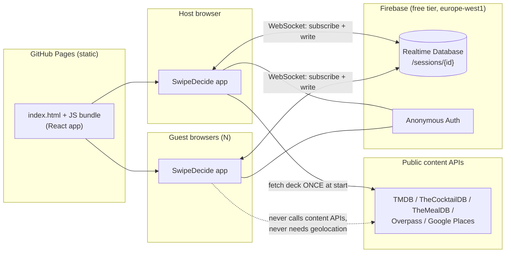
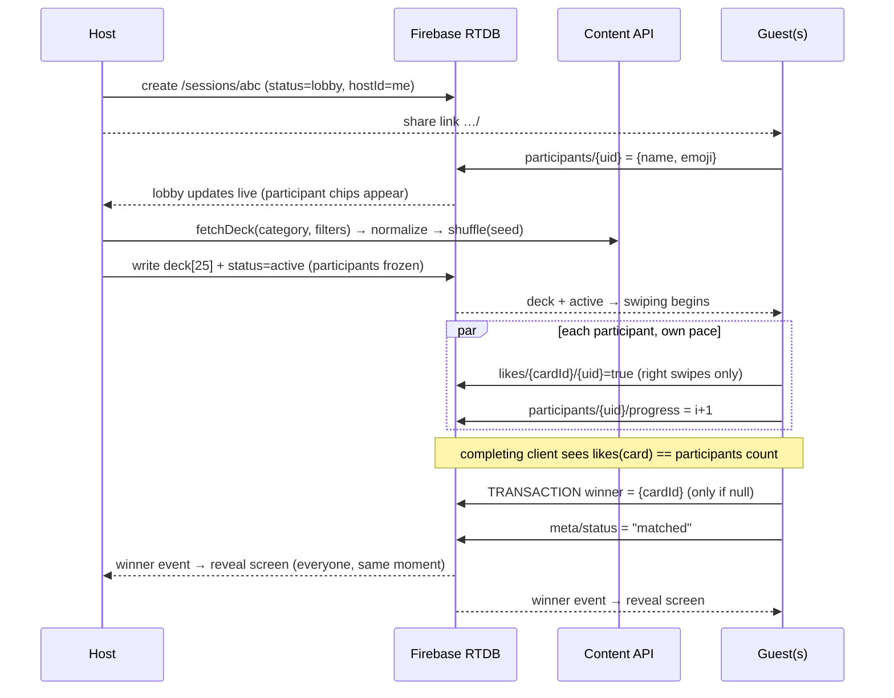

# SwipeDecide — Product & Technical Plan

*Architecture, tech stack, API selection, data model, sync design, MVP scope, and risk register.*
*Last updated: 2026-08-18. Pricing/limit figures reflect early-2026 research — re-verify each provider's terms before launch.*

> **Status: implemented.** This plan has been built. All five categories, solo
> and group modes, DE/EN, and the Pages pipeline are in the repository — see
> [§12 What was built](#12-what-was-built) for how the shipped code differs
> from the plan below, and the [README](../README.md) to run it.

---

## Table of contents

1. [Product summary & decision rules](#1-product-summary--decision-rules)
2. [Recommended tech stack](#2-recommended-tech-stack)
3. [Category data sources (APIs)](#3-category-data-sources-apis)
4. [Data model](#4-data-model)
5. [Group-mode sync architecture](#5-group-mode-sync-architecture)
6. [Design & UX blueprint](#6-design--ux-blueprint)
7. [Localization (DE/EN)](#7-localization-deen)
8. [API keys & secrets on a static host](#8-api-keys--secrets-on-a-static-host)
9. [MVP scope & build plan](#9-mvp-scope--build-plan)
10. [Risks & mitigations](#10-risks--mitigations)
11. [Open decisions](#11-open-decisions)

---

## 1. Product summary & decision rules

SwipeDecide helps individuals and groups make a choice by swiping through a deck of cards in one of five categories: **Restaurants, Cocktails, Recipes, Movies, Activities**.

### Decision rules (the contract the whole app is built around)

**Solo mode**
- A deck of ~25 cards is fetched and shuffled.
- Left swipe = pass, advance to next card.
- **The first right swipe wins.** The round ends immediately with a result screen.
- If the deck is exhausted with no right swipe: "no match" screen with a *reshuffle / new deck* action.
- Solo mode touches **no backend at all** — pure client state. (Privacy win + zero Firebase usage.)

**Group mode**
- A host picks a category (and filters), which creates a **session** and a shareable link (`…/#/s/<sessionId>`).
- Anyone with the link joins with a lightweight identity (name + emoji, no account; an anonymous Firebase UID is minted silently).
- The host starts the round; at that moment the **participant list is frozen** and the deck is written to the session so every device sees the *identical cards in identical order*.
- Everyone swipes independently at their own pace.
- **The first card that *all* participants have right-swiped wins.** All devices immediately jump to the reveal screen.
- If everyone finishes the deck with no unanimous card: "no match" screen ranking cards by like-count, with a *rematch with the top 10* action (v1.1).

Edge-case rulings (documented up front so implementation and tests agree):

| Situation | Ruling |
|---|---|
| Link opened after the round started | Read-only "session in progress" screen; can watch for the reveal but not swipe (participants are frozen at start). |
| Participant refreshes / phone locks | Anonymous UID persists in the browser → they rejoin as themselves, deck position restored from their `progress`. |
| Host closes the tab | Irrelevant after start — the session lives in the database; the host is only special in the lobby. |
| Group of 1 | Allowed; behaves like solo (any like is unanimous). |
| Two participants finish, one goes idle | Presence strip shows who is still swiping / who disconnected. Host gets "End round now" which triggers the no-match ranking. |
| Simultaneous completing likes on different cards | Winner is decided by a **write-once transaction** — exactly one card wins, all clients converge on it (see §5.4). |
| Deck-content drift (APIs are non-deterministic) | Impossible by design: only the host calls content APIs; the deck snapshot in the DB is the single source of truth. |

---

## 2. Recommended tech stack

| Layer | Pick | Why (and what was rejected) |
|---|---|---|
| Build/runtime | **Vite + React 19 + TypeScript** | First-class static output for GitHub Pages (`base` config), instant dev server, huge ecosystem for gesture/animation libs. *Rejected:* Next.js (SSR features wasted on Pages, export mode fights routing), vanilla JS (swipe stack + realtime sync + i18n gets messy fast), Svelte (fine choice, but React has the strongest gesture/animation options). |
| Swipe & animation | **Framer Motion (`motion`)** | Production-grade drag gestures with velocity, springs, and exit animations — everything a Tinder-style stack needs (`drag`, `useMotionValue`, `useTransform`, `AnimatePresence`). *Rejected:* `react-tinder-card` (less control over physics/stamps, thin maintenance), hand-rolled pointer events (weeks of edge cases: multi-touch, scroll-lock, velocity math). |
| Styling | **Tailwind CSS v4 + design tokens (CSS variables)** | Fast iteration, consistent spacing/typography scale, dark mode via `prefers-color-scheme`, tiny purged output. Tokens keep the "own visual identity" swappable. |
| Local state | **Zustand** | The app state is small (current deck, index, phase, locale). Zustand is ~1 KB, no boilerplate, works outside React (useful for the swipe engine). *Rejected:* Redux (overkill), Context-only (re-render churn on every swipe). |
| Group state | **Firebase Realtime Database (RTDB) + Anonymous Auth** — region `europe-west1` | The session document in RTDB *is* the shared state; clients subscribe with `onValue` and write swipes directly. Rationale in §5.1. |
| Routing | **react-router in Hash mode** (`/#/s/abc123`) | GitHub Pages can't rewrite URLs to `index.html`; hash routing makes shared session links work with zero 404 hacks and survives Pages' project-path prefix. |
| i18n | **react-i18next** with JSON files (`src/locales/{en,de}.json`) | Industry standard, lazy namespaces, interpolation/plurals, detection via `navigator.language` with a persisted manual toggle. |
| Data fetching | **TanStack Query** (light usage) | Caching, retry/backoff, and deduping for the content APIs — pays for itself on Overpass retries alone. *(Not used in the end — see §12: a ~60-line `fetchJson` with timeout/retry plus a `useDeck` hook covered the need without the dependency.)* |
| Testing | **Vitest + React Testing Library**; Playwright for one smoke E2E (swipe → match) | Deck providers and match logic are pure functions → cheap unit coverage where correctness matters most. |
| CI/CD | **GitHub Actions → `actions/deploy-pages`** | Official Pages flow; build-time injection of `VITE_*` env vars from repo secrets (see §8). |
| PWA (polish) | `vite-plugin-pwa` | Installable to home screen, offline app shell. Not MVP-blocking. |

### Real-time sync: why Firebase RTDB specifically

| Option | Verdict | Notes |
|---|---|---|
| **Firebase RTDB (Spark, free)** | ✅ **Pick** | 100 simultaneous connections, 1 GB stored, 10 GB/mo download — connection-based, not per-read, so swipe-heavy sessions are predictable. Native `onDisconnect` for presence, transactions for the write-once winner, WebSocket latency ~50–150 ms, EU region available, and crucially: **free projects never pause**. Config is public by design; security via rules, not secrecy. |
| Firestore | ◻️ Fine, second choice | Free tier counts every listener read (50 k reads/day); chatty swipe sessions burn it faster and latency is slightly higher. Presence requires extra machinery. |
| Supabase Realtime | ❌ | Good tech, but **free projects pause after ~1 week of inactivity** — fatal for a sporadically used hobby app (first group of the month hits a dead backend). |
| Ably / Pusher (pub-sub) | ❌ | Messaging only — no persisted session state, so refresh/late-join recovery needs a second store anyway. |
| PartyKit / Cloudflare DO | ❌ for now | Great model, but pricing/free-tier stability post-acquisition is uncertain and it adds a deploy target. |
| Trystero (P2P WebRTC, zero backend, keyless) | 🧪 Interesting fallback | Magical demo (no signup at all), but no persistence (refresh loses state), NAT/corporate-network failures, and signaling reliability make it wrong as the primary. Adapter interface keeps the door open. |

---

## 3. Category data sources (APIs)

All providers are wrapped behind one interface so categories are pluggable and a dead API is a one-file swap (see §4.1). **Only the host device calls content APIs** (once, at deck creation) — guests read the deck from RTDB. This slashes rate-limit exposure by ~N× and means guests never need geolocation or API access.

> ⚠️ Free tiers change often (several did in 2024–2025). Re-verify each row before building against it.

### 3.1 Restaurants — the only hard one

Requirement: nearby search (≤ 10 km radius), optional **minimum-rating filter**, photo + short description per card. No single free API delivers all three, so use a **dual-provider strategy**:

| | **Primary: OpenStreetMap Overpass API** | **Enhanced (optional): Google Places API (New)** |
|---|---|---|
| Auth | **None** (keyless) | API key, billing account required (card on file) |
| Cost / limits | Free; fair use ≈ 2 concurrent slots per IP, ~10 k queries/day. Public instances: `overpass-api.de`, mirror `overpass.kumi.systems` | Post-March-2025 per-SKU free tiers: Nearby Search with rating fields falls in the higher SKU (~1 k free calls/mo); Place Photo ~10 k free/mo. One search = one call = up to 20 places. **Set hard quota caps + budget alerts.** |
| CORS | ✅ `Access-Control-Allow-Origin: *` | ✅ (the *New* Places REST API supports browser calls) |
| Ratings | ❌ none in OSM | ✅ `rating`, `userRatingCount`, `priceLevel` |
| Photos | ❌ rare (`image` tag sometimes) → cuisine-based illustrated placeholders | ✅ photo media endpoint |
| Key safety | n/a | ✅ **HTTP-referrer restriction** to your Pages origin + API restriction to Places only → safe to ship client-side |
| Example | `nwr["amenity"~"restaurant\|fast_food\|cafe"](around:5000,52.52,13.405); out center 60;` | `POST https://places.googleapis.com/v1/places:searchNearby` with `X-Goog-FieldMask: places.id,places.displayName,places.rating,places.photos,…` |

Product behavior: OSM mode is the default (works for everyone, zero setup, zero cost); if a Google key is configured at build time, an "enhanced" mode unlocks the star-rating filter and real photos. The rating-filter UI is hidden in OSM mode rather than pretending.

Fallbacks considered: **Geoapify Places** (OSM-based, free 3 k credits/day, key restrictable — a hosted-Overpass with nicer ergonomics if public Overpass instances throttle us); **Foursquare Places** (in flux since the 2024 open-data pivot — re-verify before adopting); **Yelp Fusion** (❌ no CORS ever, and new signups moved to paid — not viable client-side).

Geolocation: browser Geolocation API (HTTPS ✅ on Pages). If permission is denied → manual city search via **Photon** (`photon.komoot.io` — free, keyless, CORS, typo-tolerant geocoding; Nominatim as alternate with 1 req/s etiquette).

### 3.2 Cocktails

| | **TheCocktailDB** |
|---|---|
| Auth | Dev/test key `1` (free for development & educational use); production key via a small Patreon pledge |
| Limits | Fair use; no hard published rate limit on the free key. Batch endpoints (`randomselection.php`) are premium-only |
| CORS | ✅ |
| Images | ✅ `strDrinkThumb` (+ `/preview` and `/small` size variants) |
| German | ✅ partial — `strInstructionsDE` exists on many drinks |
| Deck strategy | `filter.php?a=Alcoholic` (and `?a=Non_Alcoholic`) returns the full id/name/thumb list in one call → shuffle client-side → hydrate the top 25 via `lookup.php?i={id}` (≤ 25 small cached calls, host-only) |
| Fallback | Bundle a static snapshot of ~50 popular drinks in the repo as an offline/failure fallback (data is CC-style openly aggregated; keep attribution) |

### 3.3 Recipes

| | **TheMealDB** (primary) | Spoonacular (rejected for now) |
|---|---|---|
| Auth | Test key `1`, same family/terms as TheCocktailDB | Key required |
| Limits | Fair use | Only 150 points/day free, and the key **cannot be domain-restricted** → shipping it in a public bundle burns the quota for anyone who extracts it |
| CORS | ✅ | ✅ |
| Images | ✅ `strMealThumb` (+ size variants) | ✅ richer data (nutrition, diets) |
| Deck strategy | `filter.php?c={category}` / `filter.php?a={area}` lists → shuffle → hydrate 25 via `lookup.php?i=` | Later, behind a proxy, if dietary filters become a feature |
| German | ❌ content is EN-only → German UI shows recipe names/instructions in EN (food names travel fine); category/area labels translated via a small static map |

### 3.4 Movies — the easiest category

| | **TMDB (The Movie Database)** |
|---|---|
| Auth | Free API key (v3) / read token (v4); free for non-commercial use, **attribution required** ("This product uses the TMDB API but is not endorsed…") |
| Limits | ~50 req/s soft limit (legacy 40/10 s cap retired) — irrelevant at our volume |
| CORS | ✅ |
| Images | ✅ `https://image.tmdb.org/t/p/w500{poster_path}` |
| German | ✅ **first-class**: `language=de-DE` returns German titles & synopses |
| Deck strategy | One call ≈ one deck: `GET /discover/movie?language=de-DE&sort_by=popularity.desc&vote_count.gte=200&page=1` returns 20 cards with title, overview, poster, rating. Genre filter = `with_genres`. |
| Key caveat | TMDB keys can't be referrer-restricted → the shipped key is extractable. Acceptable for a free non-commercial key (worst case: register a new one); optional hardening = Cloudflare Worker proxy (§8) |
| Fallback | OMDb (1 k req/day free) — poorer discovery, last resort |

### 3.5 Activities

The original **Bored API (`boredapi.com`) shut down in 2024** — a cautionary tale for tiny free APIs. Community mirrors (e.g. `bored-api.appbrewery.com`) exist but are unreliable dependencies, English-only, and image-less.

**Recommendation: ship a curated, bundled dataset instead of an API.**
- `src/data/activities.{en,de}.json`: 50–80 hand-curated activities (board-game night, sunset picnic, museum visit, escape room, …), each with DE+EN text, tags (indoor/outdoor, solo/group, free/paid, day/night), and a bundled illustration or emoji tile.
- Zero rate limits, zero CORS, zero shutdown risk, perfectly localized, works offline — and for generic activity *ideas*, curation beats any free API's quality anyway.
- Optional later: a location-aware "Attractions nearby" variant reusing the Overpass adapter (`tourism=attraction`, `leisure=*`) — no new API needed. (OpenTripMap exists — free key, 5 k req/day — but the project looks semi-abandoned; skip.)

### 3.6 CORS & auth summary matrix

| API | Key needed | Key restrictable | CORS | Cost risk if key leaks |
|---|---|---|---|---|
| Overpass (OSM) | No | — | ✅ | — |
| TheCocktailDB | Test key `1` | — | ✅ | none (shared dev key) |
| TheMealDB | Test key `1` | — | ✅ | none |
| TMDB | Yes (free) | ❌ | ✅ | low (quota abuse; non-billing) |
| Google Places (New) | Yes | ✅ referrer | ✅ | low **if** referrer-restricted + quota-capped; unbounded if not — always cap |
| Photon geocoder | No | — | ✅ | — |
| Firebase RTDB | Public config (not a secret) | via Rules/App Check | ✅ (WebSocket) | governed by security rules |

**The MVP ships with zero real secrets** (Cocktails + Recipes keyless, TMDB free-tier key accepted as public, Firebase config public by design).

---

## 4. Data model

### 4.1 The normalized `Card` and the provider interface (architectural keystone)

Every category maps into one shape, so the swipe engine, session sync, and result screens are category-agnostic:

```ts
type CategoryId = 'restaurants' | 'cocktails' | 'recipes' | 'movies' | 'activities';

interface Card {
  id: string;                 // provider-namespaced, e.g. "tmdb:603", "osm:node/240109189"
  title: string;              // "Pulp Fiction", "Negroni", "Trattoria Bella"
  subtitle?: string;          // one-line description shown on the card
  imageUrl?: string;          // https-only; undefined → styled placeholder
  badge?: string;             // "4.6 ★" | "IPA" | "20 min" — small chip on the card
  meta?: Record<string, string>; // detail rows for the result screen (address, glass, runtime…)
  sourceUrl?: string;         // attribution / action link (recipe page, Google Maps directions, TMDB page)
}

interface DeckOptions {
  locale: 'de' | 'en';
  size: number;               // target deck size, default 25
  seed: string;               // deterministic shuffle for reproducibility/tests
  location?: { lat: number; lng: number; radiusM: number };  // restaurants (radiusM ≤ 10_000)
  minRating?: number;         // restaurants, enhanced mode only
  genreIds?: number[];        // movies
  tags?: string[];            // activities
}

interface DeckProvider {
  id: CategoryId;
  capabilities: { needsLocation: boolean; supportsRatingFilter: boolean };
  fetchDeck(opts: DeckOptions): Promise<Card[]>;
}
```

Providers live in `src/providers/` (`cocktails.ts`, `meals.ts`, `movies.ts`, `restaurants/osm.ts`, `restaurants/google.ts`, `activities.ts`). A dead or changed API is a one-file fix — this is the mitigation for the Bored-API failure mode.

### 4.2 Solo session (client-only, no backend)

```ts
interface SoloRound {
  category: CategoryId;
  deck: Card[];
  index: number;                       // current card
  phase: 'swiping' | 'matched' | 'exhausted';
  winner?: Card;
}
```

Persisted to `sessionStorage` so an accidental refresh doesn't lose the round.

### 4.3 Group session (Firebase RTDB)

One subtree per session under a short unguessable id (`nanoid(10)` — the link is the capability). The participant id **is** the anonymous Firebase `auth.uid`, which persists per browser → free rejoin-after-refresh identity.

```jsonc
// /sessions/{sessionId}
{
  "meta": {
    "v": 1,                          // schema version
    "category": "movies",
    "status": "lobby",               // lobby → active → matched | exhausted | expired
    "hostId": "<uid>",
    "createdAt": 1755523200000,      // serverTimestamp
    "startedAt": null,
    "locale": "de",                  // content language the deck was fetched in
    "filters": { "radiusM": 5000, "minRating": 4 }   // display-only echo; NO coordinates stored (privacy)
  },

  // Written exactly once by the host at start. Single source of truth for
  // content & order — guests never call content APIs.
  "deck": [ { "id": "tmdb:603", "title": "…", "subtitle": "…", "imageUrl": "…", "badge": "8.1 ★" } ],

  "participants": {
    "<uid>": {
      "name": "Anna", "emoji": "🦊",
      "joinedAt": 1755523210000,
      "online": true,                // maintained via onDisconnect()
      "progress": 12,                // index of next unswiped card (drives “waiting” UI)
      "done": false
    }
  },

  // Right-swipes ONLY. Left swipes just advance `progress` — nothing to store.
  "likes": {
    "tmdb:603": { "<uidA>": true, "<uidB>": true }
  },

  // Write-once via transaction — the atomic decision (see §5.4).
  "winner": { "cardId": "tmdb:603", "decidedAt": 1755523456000, "byUid": "<uidB>" }
}
```

Size budget: deck 25 × ~400 B ≈ 10 KB; likes/participants are tiny → **a session is ~15–25 KB**, so the 1 GB free tier holds tens of thousands of sessions and the 10 GB/mo download budget supports thousands of active group rounds.

### 4.4 Security rules (sketch)

Security comes from rules, not from hiding the Firebase config:

```jsonc
{
  "rules": {
    "sessions": {
      "$sid": {
        // Link = capability: any signed-in (anonymous) client that knows $sid may read.
        ".read": "auth != null",

        "meta": {
          // Create by anyone; afterwards only the host mutates meta (status transitions).
          ".write": "auth != null && (!data.exists() || data.child('hostId').val() === auth.uid)",
          "status": { ".validate": "newData.isString() && newData.val().matches(/^(lobby|active|matched|exhausted|expired)$/)" }
        },
        "deck": {
          // Host writes it once, only while in lobby.
          ".write": "auth != null && root.child('sessions/'+$sid+'/meta/hostId').val() === auth.uid && !data.exists()",
          ".validate": "newData.hasChildren()"
        },
        "participants": {
          "$uid": {
            // You may only write yourself; joining only while in lobby (presence fields exempt).
            ".write": "auth != null && $uid === auth.uid",
            "name": { ".validate": "newData.isString() && newData.val().length <= 24" }
          }
        },
        "likes": {
          "$cardId": {
            "$uid": {
              // Only your own like, only `true`, only while active, only if you are a participant.
              ".write": "auth != null && $uid === auth.uid
                         && newData.val() === true
                         && root.child('sessions/'+$sid+'/meta/status').val() === 'active'
                         && root.child('sessions/'+$sid+'/participants/'+$uid).exists()"
            }
          }
        },
        "winner": {
          // Write-once, by any participant (the one whose like completed the match).
          ".write": "auth != null && !data.exists()
                     && root.child('sessions/'+$sid+'/participants/'+auth.uid).exists()"
        }
      }
    }
  }
}
```

(Exact join-only-in-lobby vs. presence-update nuance gets refined during implementation; the invariants to enforce are: *self-writes only, likes are append-only `true`, deck immutable after start, winner write-once*.)

---

## 5. Group-mode sync architecture

### 5.1 Shape of the solution

GitHub Pages serves only static files, so the "backend" must be a hosted, client-connectable service. The design: **the RTDB session subtree is the shared state machine**; every client holds a WebSocket subscription to it and writes only its own facts (its join, its likes, its presence). Winner detection is decentralized but made safe by a write-once transaction.



### 5.2 Session lifecycle



### 5.3 Why this needs no polling and stays "real-time enough"

- RTDB pushes deltas over an open WebSocket; typical fan-out latency is well under 200 ms — a match reveal feels simultaneous.
- Each swipe is one tiny write (`likes/{card}/{uid}=true`, ~60 B) plus one `progress` update. A 5-person, 25-card worst-case session is ~250 writes — noise against free-tier limits.
- Offline blips are absorbed: the SDK queues writes and replays on reconnect; `onDisconnect` flips `online=false` so the group sees who dropped.

### 5.4 Match detection & the race condition

Every client already holds the full `likes` + `participants` state locally (it's subscribed). After any like lands:

```
isWinner(card) := status == 'active'
                  && every uid in participants: likes[card.id][uid] == true
```

Two participants can *complete* different cards near-simultaneously (A's last like on card 3 and B's last like on card 7 race). Resolution: the completing client runs a **transaction on `/winner`** that only sets a value if it is currently `null`. Exactly one transaction commits; the loser aborts and both devices converge on the committed winner. `winner` is the single authoritative fact; `status=matched` is derived convenience.

First-match semantics note: "the first card **all** participants liked" is evaluated in *completion time*, not deck order — the earliest moment unanimity exists, matching the spec ("as soon as all participants have swiped right on the same card").

Everyone-done-no-winner: when the last participant sets `done=true` and `winner` is null, that client (or the host via "End now") sets `status=exhausted`; clients render the like-count ranking locally from `likes`.

### 5.5 Why the host fetches the deck (and not each client)

1. **Consistency** — content APIs are non-deterministic (popularity shifts, nearby results reorder); a stored snapshot guarantees identical decks.
2. **Privacy** — only the host's device uses geolocation; coordinates are used transiently for the API call and never written to the DB.
3. **Rate limits** — N participants cost 1× API usage, not N×.
4. **Simplicity** — guests need zero API keys, zero permissions; they just read the deck.

### 5.6 Session hygiene

- Sessions carry `createdAt`; clients treat anything older than 24 h as `expired` (read-side guard — no server needed).
- Physical deletion needs an actor: on the free plan we simply let tiny sessions accumulate (years of headroom at 25 KB/session); the growth path is Blaze plan + one scheduled Cloud Function purging `createdAt < now-7d`. Documented, not built.

---

## 6. Design & UX blueprint

**Identity direction:** "editorial minimalism" — Apple-adjacent calm (generous whitespace, precise type, soft depth) with one ownable signature: a warm **sunset gradient accent** (coral → amber) against off-white/ink neutrals, and oversized rounded cards (24 px radius) with layered soft shadows. Deliberately *not* Tinder's flame-red visual language, no flame/fire iconography. Dark mode from day one (tokens make it cheap). System font stack (SF on Apple, Inter fallback) for the native-feel + zero font-loading cost; Google-Fonts Inter optional.

### Swipe interaction spec (the soul of the app — worth pinning down numerically)

| Aspect | Spec |
|---|---|
| Drag | 1:1 translation with pointer; card rotation = `offsetX / 20`, clamped ±14° |
| Stamps | LIKE (green, rotated −12°) / NOPE (red, +12°) fade in from 40 px of drag, fully opaque at threshold |
| Commit | `abs(offsetX) > 35%` of card width **or** fling velocity > 500 px/s |
| Release below threshold | Spring back (stiffness ≈ 500, damping ≈ 30) |
| Exit | Continues gesture velocity off-screen, 250–350 ms, slight extra rotation |
| Stack | Top 3 cards rendered; behind-cards at scale 0.95/0.90 with 12 px vertical offset, promoted with a spring on advance |
| Fallbacks | ✕ / ♥ buttons under the stack (accessibility + desktop), ← / → keys, `prefers-reduced-motion` → crossfade instead of fling |
| Haptics | `navigator.vibrate(10)` on commit (Android; iOS Safari ignores — acceptable) |
| Scroll lock | `touch-action: pan-y` on card, overscroll containment on the stack area |

### Screen inventory

1. **Home** — app name, language toggle (DE/EN), category grid (5 illustrated tiles), mode switch *Solo / Group*.
2. **Filters** (restaurants only) — radius slider (0.5–10 km), "use my location" / city search (Photon), min-rating chips (enhanced mode only).
3. **Solo swipe** — stack + progress dots; first like → **Result**.
4. **Result / Match reveal** — hero card scales in with a spring + confetti burst; context actions per category (🍽 open in Maps / 🍸 full recipe / 🎬 TMDB page); *share result* and *go again*.
5. **Group lobby** (host) — big copy-link button + Web Share API, participant chips popping in live, *Start* (disabled until ≥ 1 guest or host override).
6. **Join** (guest) — name + emoji picker, one tap to enter lobby.
7. **Group swipe** — stack + slim presence strip (avatars with progress rings; grey = disconnected); "you're done — waiting for Anna 🦊" state with gentle animation.
8. **No-match** — ranked like-count list, *rematch with top 10* (v1.1), *new deck*.

Responsive: mobile-first (stack fills viewport width minus 24 px gutters, max-width 420 px); desktop centers the phone-ish column with the category rail beside it. All interactive targets ≥ 44 px.

---

## 7. Localization (DE/EN)

- **All UI strings in JSON from commit #1** (`src/i18n/locales/en.json`, `de.json`) — retrofitting i18n is the expensive path. Keys namespaced by screen (`home.title`, `group.lobby.copyLink`…). ICU-style plurals via i18next.
- Detection: `navigator.language` → default; manual toggle persisted in `localStorage`; `<html lang>` kept in sync.
- **Content** localization per source: TMDB fully localized via `language=de-DE` (deck fetched in the session's `locale`); TheCocktailDB uses `strInstructionsDE` when present, EN fallback; TheMealDB EN-only (food names travel fine; category labels translated via a small static map); OSM names are inherently local; the bundled activities dataset is authored bilingually.
- Numbers/units via `Intl.NumberFormat` (km radius, ratings).

---

## 8. API keys & secrets on a static host

**Ground truth: anything shipped to a static client is public.** A key in the bundle is extractable regardless of how it got there. The strategy is therefore tiered:

1. **Prefer keyless APIs** — the MVP (Cocktails, Recipes + shared dev keys; Overpass; Photon; bundled activities) ships with *zero real secrets*.
2. **Restrictable keys are safe client-side** — the Google Places key gets (a) HTTP-referrer restriction to `https://<user>.github.io/*`, (b) API restriction to Places API (New) only, (c) hard quota caps + billing alerts. A leaked referrer-locked, quota-capped key is near-useless.
3. **Non-restrictable free keys (TMDB): accept, contain, or proxy.** Inject via GitHub Actions repo secret → `VITE_TMDB_KEY` at build time. This keeps keys **out of git history** (important: a key committed once lives in history forever) but *not* out of the bundle — be honest about that. Risk is quota abuse on a non-billing key; worst case, rotate. Optional hardening: a ~40-line Cloudflare Worker proxy (free 100 k req/day) that holds the key, checks the `Origin` header, and caches responses.
4. **Firebase config is not a secret** — it identifies the project; protection is Security Rules (§4.4) plus, as later hardening, **App Check** (reCAPTCHA v3 provider, free) so only your web app can talk to the DB.

Repo hygiene: `.env` gitignored, `.env.example` documents every variable, secrets live only in GitHub Actions (`Settings → Secrets`), and a build-time check fails CI if a `VITE_GOOGLE_*` key is present without the referrer-restriction checklist acknowledged in the PR.

---

## 9. MVP scope & build plan

### Cutline rationale

| Category | Value | Complexity | Verdict |
|---|---|---|---|
| Movies | High (universal, great posters) | **Trivial** (1 call = 1 localized deck) | ✅ MVP |
| Cocktails | Medium-high | Low (keyless) | ✅ MVP |
| Recipes | Medium-high | Low (keyless) | ✅ MVP |
| Restaurants | **Highest** (the killer use case) | **Highest** (geo permission, dual provider, ratings, photos) | 🔜 fast-follow — don't let it block validating the core loop |
| Activities | Medium | Trivial (bundled JSON) | 🔜 with restaurants (cheap filler win) |

**MVP = the complete decision loop, polished:** solo + group modes, Movies/Cocktails/Recipes, DE/EN, deployed on Pages. Restaurants is v1.1 — it's the flagship category, but the swipe feel and group sync are the risk to retire first, and they're category-agnostic thanks to the provider interface.

### Milestones (focused days; ~2–3 part-time weeks to MVP)

| # | Milestone | Contents | Est. |
|---|---|---|---|
| **M0** | Skeleton & rails | Vite+React+TS scaffold, Tailwind tokens (light/dark), hash routing, i18next with full DE/EN files, GitHub Actions → Pages pipeline **deploying from day one** | 1–2 d |
| **M1** | Swipe engine + solo | Card stack per §6 spec, provider interface, Cocktails provider, solo win/exhausted flows, result screen | 2–3 d |
| **M2** | Category breadth | Recipes + Movies providers, category grid, per-category result actions, TMDB key via Actions secret | 1–2 d |
| **M3** | **Group mode** | Firebase project (europe-west1) + anonymous auth + security rules; lobby/join/share-link; deck publish; live likes/progress/presence; winner transaction; reveal + no-match screens | 3–4 d |
| — | **← MVP ships here** | | **7–11 d** |
| **M4** | Restaurants | Geolocation + Photon city fallback, radius filter, Overpass provider with mirror rotation + placeholder art; *enhanced mode*: Google Places (New) provider, rating filter, photos, referrer-locked key | 2–3 d |
| **M5** | Activities + polish | Bilingual activities dataset + illustrations; rematch-with-top-10; PWA install; confetti/haptics/sound polish; empty/error states pass | 2 d |
| **M6** | Hardening | App Check, session-expiry UX, Playwright smoke (create → join → match), device QA matrix (iOS Safari, Android Chrome, desktop), rules-emulator tests | 2 d |

Definition of done for MVP: two phones on different networks create/join via link, swipe a Movies deck, and hit a simultaneous reveal in < 1 s; Lighthouse mobile ≥ 90; full UI in both languages.

---

## 10. Risks & mitigations

| # | Risk | Likelihood | Impact | Mitigation |
|---|---|---|---|---|
| 1 | **CORS blocks** an API from the browser | Low for chosen set (all verified CORS-friendly; Yelp excluded for exactly this) | High if missed | CORS status was a hard selection criterion (§3.6); re-verify with a spike call in M0; Cloudflare Worker proxy is the universal escape hatch |
| 2 | **Overpass throttling / instance downtime** | Medium | Medium (restaurants degraded) | Host-only fetch (1 call/session), retry across mirrors (`overpass-api.de` → `kumi.systems`), 10 s timeout + friendly error, cache last result in `sessionStorage`; Geoapify as configured fallback |
| 3 | **Google billing surprise** | Low | High | Enhanced mode is optional & off by default; hard quota caps at the console, budget alert at €1, referrer-locked key; OSM mode is the permanent free path |
| 4 | **TMDB key extracted from bundle** | Certain (it's public) | Low | Free non-commercial key, no billing attached; rotate if abused; Worker proxy documented as hardening |
| 5 | **Tiny free API disappears** (Bored API precedent) | Medium over years | Medium | Provider adapter isolates each source to one file; activities pre-emptively bundled; static snapshot fallback for cocktails/recipes |
| 6 | **Geolocation denied / unavailable** | Medium | Medium | Photon city search fallback + radius around the geocoded point; Pages is HTTPS so the API is available; clear permission-priming copy before the browser prompt |
| 7 | **Firebase free-tier ceilings** (100 concurrent, 10 GB/mo) | Low at hobby scale | Medium | ~15–25 KB/session and connection-based pricing give huge headroom (≈ 30+ simultaneous group sessions); usage dashboard check-ins; Blaze upgrade is the documented growth path |
| 8 | **Winner race** (two cards complete simultaneously) | Certain eventually | High (two devices show different winners) | Write-once transaction on `/winner` (§5.4) + unit tests + rules forbidding overwrite |
| 9 | **Deck inconsistency across devices** | — | High | Eliminated by design: host-written snapshot is the single source (§5.5) |
| 10 | **Participant drops mid-round** (match becomes impossible) | Medium | Medium | `onDisconnect` presence, "waiting for…" transparency, host *End round now* → ranked no-match result; v1.1: host may remove a departed participant (recount can immediately crown a winner) |
| 11 | **GH Pages SPA routing breaks shared links** | Certain with history routing | High | Hash routing (`/#/s/id`) — no 404 hack, survives the `/choiceapp/` base path |
| 12 | **iOS Safari quirks** (viewport 100vh, rubber-banding, no vibrate) | High | Medium | `dvh` units, `touch-action`/overscroll containment, haptics treated as progressive enhancement; iOS Safari in the M6 QA matrix |
| 13 | **Broken/hotlink-blocked images** | Medium | Low | `onerror` → branded gradient placeholder with initials; images referenced (never stored) and HTTPS-only |
| 14 | **Abuse of open DB** (spam sessions, junk writes) | Low | Medium | Rules: self-writes only, validated shapes, name length caps, unguessable session ids; App Check in M6; no PII beyond a chosen display name |
| 15 | **GDPR/privacy expectations (German audience)** | — | Medium | EU region (`europe-west1`), coordinates never persisted, anonymous auth, no analytics by default (or cookie-less Plausible later), short privacy note page |
| 16 | **Free-tier terms drift** (they changed for Google, Yelp, Foursquare, Supabase within 2024–25) | Medium | Medium | This doc's pricing table re-verified at M2/M4 before wiring each provider; adapters make swaps cheap |

---

## 11. Open decisions

1. **Name/branding** — repo says `choiceapp`, doc says *SwipeDecide*. Pick before M0 (affects Pages URL, manifest, strings).
2. **Google enhanced mode at launch or later?** Needs a billing account. Recommendation: build OSM-only in M4; add the Google provider once the card-on-file question is settled.
3. **TMDB via direct client key vs. Cloudflare Worker proxy from day one?** Recommendation: direct for MVP, proxy only if abuse shows up.
4. **Spectator behavior for late joiners** — read-only watch (recommended, simple) vs. "join next round" queue.
5. **Analytics** — none (recommended for MVP) vs. cookie-less Plausible/Umami later.
6. **Custom domain** for Pages? Nice for share-link trust (`swipedecide.app` vs `github.io`), and it's what the Google key would be referrer-locked to.

---

## 12. What was built

The implementation follows this plan. Four deliberate changes were made while
building, each because the code proved the plan wrong or incomplete:

**All five categories shipped, not the three-category MVP.** The provider
interface (§4.1) made restaurants and activities cheap enough to include once
the swipe engine existed, so the M4/M5 cutline was unnecessary.

**A second sync adapter was added.** The plan assumed Firebase or nothing,
which made group mode undemonstrable without a project and credentials. The
`SyncAdapter` interface (`src/sync/types.ts`) now has two implementations:
Firebase RTDB, and a same-device adapter over BroadcastChannel + localStorage
used automatically when Firebase is unconfigured. Screens never branch on
which is active; they read `isCrossDevice` only to show an honest notice.
Identity in the local adapter is **per tab** (sessionStorage), so two tabs are
two genuine participants and a real group round can be played on one machine.

**Firebase is dynamically imported.** A static import put the whole SDK in the
main bundle even for solo rounds, which never touch it — 802 kB, 225 kB
gzipped. The adapter now imports `firebase/{app,auth,database}` on first use,
cutting the initial bundle to 456 kB / 150 kB gzipped, with Firebase fetched
only when a configured group round starts.

**TanStack Query was dropped.** Exactly one screen fetches a deck, once, with
no cross-screen cache to share. A `fetchJson` helper with timeout, bounded
retries and backoff (`src/lib/http.ts`) plus an aborting `useDeck` hook covered
the requirement, so the dependency earned nothing.

**Offline snapshots carry no image URLs.** The fallback datasets
(`src/data/fallback*.ts`) deliberately omit image URLs: TheCocktailDB,
TheMealDB and TMDB all use opaque CDN hashes that cannot be derived offline,
so a fabricated URL would render as a broken image. Those cards use the
gradient placeholder instead, which reads as designed rather than broken.

### Verification performed

- **32 unit tests** over the match logic, seeded shuffle, provider registry and
  DE/EN key parity — the parts where a silent bug is expensive.
- **Browser end-to-end test** (`e2e/smoke.mjs`) driving the real build: home
  render, language switch, deck build, left-swipe advance, drag-to-like ending
  a solo round, session creation, a second tab joining, identical decks on both
  devices, one like not matching, and a unanimous match landing on both at once.
- **Stress testing** of the swipe input, which caught a real race: a card
  promoted to the top could inherit the previous card's pending trigger and
  swipe two cards on one tap. Triggers are now bound to a specific card id.
- **Responsive checks** at 320 / 390 / 1280 px in light and dark, plus
  geolocation granted and denied paths.

### Known gaps

- **Live API calls are unverified from the build environment.** Its egress
  proxy allowlists package registries only, so TheCocktailDB, TheMealDB, TMDB,
  Overpass and Photon could not be reached during development. The client code,
  response mapping and fallback paths are implemented against each API's
  documented contract, and the fallback paths are confirmed working — but the
  live responses need one pass in a real browser.
- **Firebase group sync is unexercised end to end**, for the same reason and
  because it needs a project. The local adapter validates the state machine
  (join, freeze, likes, unanimity, write-once winner, exhaustion); the Firebase
  adapter implements that same interface against RTDB.
- **Security rules are unit-tested by inspection only.** Running them against
  the Firebase emulator is the M6 task in §9 and remains outstanding.
- No PWA/offline shell, no rematch-with-top-10, no App Check yet — all §9 M5/M6
  items.

### Expansion (second iteration)

Added after launch, following the same provider/adapter conventions:

- **Five new categories** — sights (Overpass tourism/historic, venue photos via
  Commons tag/geosearch), TV shows (TVMaze, keyless+CORS; iTunes fallback),
  anime (Jikan v4 with `sfw=true` plus a client-side rating guard), protein
  recipes (TheMealDB protein categories + ingredient-keyword score, honestly
  labelled — no invented macro figures), and a custom deck (user-typed entries,
  persisted locally; the only category where images are optional).
- **Cocktails rebuilt on letter search.** The free key caps `filter.php` at its
  first ~25 alphabetical rows, which made decks start with "A". Decks now merge
  `search.php?f=<letter>` across six seeded letters (full drink objects, no
  hydration calls) and interleave the letters round-robin.
- **iTunes via JSONP.** The iTunes Search API sends no CORS headers, so browser
  fetches silently failed and movies fell back to the imageless snapshot. A
  small JSONP helper (script-tag transport, `callback` param) restores keyless
  posters for movies and TV.
- **Restaurant images are matching dish photos** (product decision): a coffee
  for the café, a stone-oven pizza for the pizzeria — TheMealDB area/search
  thumbnails first (consistent food photography, seeded per card), curated
  Commons queries as fallback. Flagged `imageIsStock`; the note lives in the
  detail sheet, not on the card face.
- **Group rounds redeal automatically.** On exhaustion the host deals a fresh
  deck of unseen cards (`meta.seenIds`), resets likes/progress atomically via a
  multi-path update, and bumps `meta.round` — capped at 3 rounds, after which
  the ranked no-match screen appears. Security rules gained the matching
  host-only, exhausted-state write permissions; existing Firebase projects must
  re-paste `firebase/database.rules.json`.
- **Images are mandatory** for every catalogue category: cards without real
  cover art are dropped at the provider. Custom decks are the deliberate
  exception.
